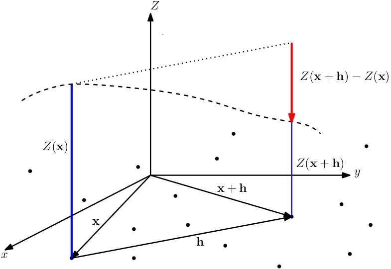
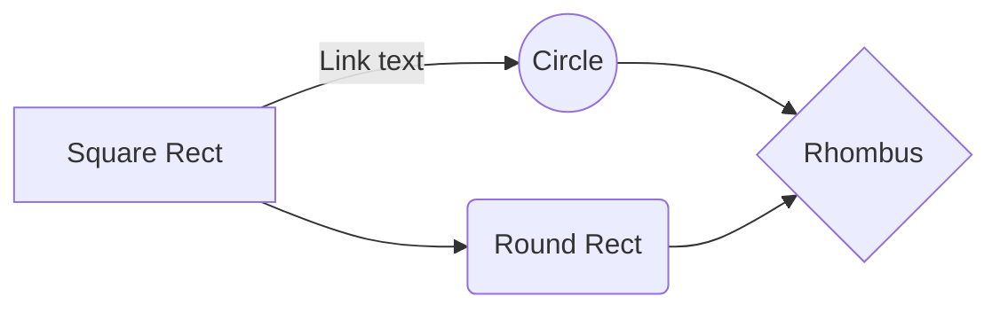

# Rainfall maps in northeastern Mexico a space time interpolation approach through Kriging and Hurst

Este repositorio está hecho con el propósito lograr la reproducibilidad de la metodología aplicada en el artículo : "Rainfall maps in northeastern Mexico a space time interpolation approach through Kriging and Hurst" (hipervínculo al artículo).

## Objetivo 

La región de estudio es la cuenca del Rio San Juan ubicada en el noreste de México, entre los estados de Coahuila, Nuevo León y Tamaulipas. Actualmente, existe una escazes de agua en esta zona, por lo que se realiza un análisis geoespacial con interpolación de Kriging, mostrando el comportamiento de la zona en base a la cantidad promedio anual de lluvia y su comportamiento histórico de  persistencia o anti-persistencia utilizando el exponente de Hurst.

## Marco teórico

Para información más detallada, revisar el Archivo Aditional 2 (hipervínculo al archivo adicional 2).

Los datos observados son mediciones de la cantidad de lluvia en distintos puntos de una región específica. La correlación espacial del campo escalar _**Z**_ como función de la distancia se conoce como *variograma* o *semivariograma*. En aclaración, aunque variograma y semivariograma son comúnmente utilizaos indistintamente, realmente pueden aportar ciertas diferencias, por ello usar el término variograma insta a realizar un cálculo completo en vez de uno parcial que es representado en el semivariograma [1].

Considere dos puntos con vectores de posición **_x_** y **_x+h_**, respectivamente, ver la Fig. 1.

  

    <em>Fig. 1 - Campo escalar Z(x) para este estudio son los valores de lluvia o exponente de Hurst. </em>

El *variograma* **γ** es la varianza de las diferencias de un campo aleatorio estacionario, esto es: 

    
    

