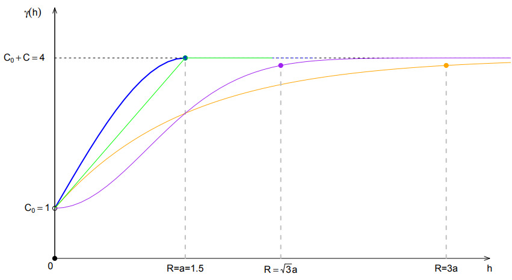

# Rainfall maps in northeastern Mexico a space time interpolation approach through Kriging and Hurst

Este repositorio está hecho con el propósito lograr la reproducibilidad de la metodología aplicada en el artículo : "Rainfall maps in northeastern Mexico a space time interpolation approach through Kriging and Hurst" (hipervínculo al artículo).

## Objetivo 

La región de estudio es la cuenca del Rio San Juan ubicada en el noreste de México, entre los estados de Coahuila, Nuevo León y Tamaulipas. Actualmente, existe una escazes de agua en esta zona, por lo que se realiza un análisis geoespacial con interpolación de Kriging, mostrando el comportamiento de la zona en base a la cantidad promedio anual de lluvia y su comportamiento histórico de  persistencia o anti-persistencia utilizando el exponente de Hurst.

## Marco teórico

Para información más detallada, revisar el Archivo Aditional 2 (hipervínculo al archivo adicional 2).

Los datos observados son mediciones de la cantidad de lluvia en distintos puntos de una región específica. La correlación espacial del campo escalar _**Z**_ como función de la distancia se conoce como *variograma* o *semivariograma*. En aclaración, aunque variograma y semivariograma son comúnmente utilizaos indistintamente, realmente pueden aportar ciertas diferencias, por ello usar el término variograma insta a realizar un cálculo completo en vez de uno parcial que es representado en el semivariograma.

Considere dos puntos con vectores de posición **_x_** y **_x+h_**, respectivamente, ver la Fig. 1.

  

    <em>Fig. 1 - Campo escalar Z(x) para este estudio son los valores de lluvia o exponente de Hurst. </em>

El *variograma* **_γ_** por definición es la varianza de las diferencias de un campo aleatorio estacionario, esto es: 

    
    

 donde **_γ_** es independiente a la localización de **_x_** y dependiente solamente del vector **_h_**.

**VARIOGRAMA EXPERIMENTAL**

El estimador clásico o variograma experimental (muestral) **_γ_*** es dado por la siguiente ecuacuión:

   
    

donde nc es el número de parejas de puntos conectados por todos los vectores **_h_** que pertenecen a una clase **_H_** de vectores cuya magnitud y dirección caen dentro de una región específica, ver la Fig.2 (en realidad 3).

  

    <em>Fig. 2 - El vector h que va del centro del círculo a cualquier punto de la región sombreada es un vector cuya magnitud está comprendida entre                 |H| y |H + a|,  con dirección comprendia entre θ y θ + b. Todos los vectores dentro de la región sombreada (famila H) son los que determinan el               promedio en la ecuación del variograma empírico.</em>

**PARÁMETROS DEL VARIOGRAMA**

El modelo teórico asociado al variograma empírico depende en general de tres parámetros independientes conocidos como el efecto *nugget* _C0_, la *meseta* parcial _C_ y el *rango* _R_, ver la Fig.3 (en realidad fig4).

  

    <em>Fig. 3 - A general theoretical model of the empirical variogram with its principal components: Range, Sill, Partial Sill and Nugget. The origin of           the horizontal scale corresponding to hmin ≡ 0.</em>

 - *El efecto nugget* : De acuerdo con la definición del variograma, cuando _h = 0_ el variograma también vale cero, _**γ**(0) = 0_. Sin embargo, en la práctica el valor teórico _h = 0_ corresponde a un valor de separación mínimo _hmin_ entre las estaciones pluviométricas. A este valor "residual" empírico del variograma se le conoce como *efecto nugget* y se representa por _**γ***(0)= C0_.

- *Meseta parcial* : Nuevamente, de acuerdo con la definición, en un proceso sin correlaciones de largo alcance, cuando _h→∞_  se espera que ρ→0, siendo ρ el coeficiente de correlación, por lo tanto, el variograma converge al valor constante _f0_. En la práctica, sin embargo, se observa que a partir de cierta distancia máxima _hmax_ el variograma empírico se "estabiliza", esto es, el variograma prácticamente ya no crece cuando _h_ aumenta. Este valor "asintótico", medido desde el *nugget*, donde el variograma se nivela con la horizontal se conoce como la *meseta parcial* y se simboliza por _C_. La suma _C0 + C_ se conce como la *meseta* o umbral del variograma.

- *Rango* : El valor  _hmax_ para el cual el modelo del variograma empírico comienza a "aplanarse" se denomina *rango* y se denota por el símbolo _R ≡ hmax_. Observaciones del campo escalar en puntos separados una distancia mayor al rango _R_ se consideran no correlacionadas, esto es, si _|xi - xj| > R_ entonces _Cov[Z(xi), Z(xj)] = 0_, _i ≠ j_.

**MODELO TEÓRICO**

Cuatro de los modelos teóricos más utilizados para ajustar los valores del variograma experimental o empírico son los siguientes \cite{mert4,montero5}, ver la Fig. 4 (en realidad fig5).

  

    <em>Fig. 4 - La figura muestra 4 de los modelos teóricos de variogramas más utilizados, un modelo esférico (curva azul), un modelo lineal (curva verde),         un modelo Gaussiano (curva morada) y un modelo exponencial (curva naranja). Para fines de comparación en todos los casos se han utilizado los mismos         parámetros: C0 = 1, C = 3, y a = 1.5. La figura muestra también el valor del rango para cada modelo: R = a, √3a, 3a para los modelos               exponencial y lineal, Gaussiano, y exponencial, respectivamente.</em>

**Variograma esférico**

El variograma esférico alcanza el valor umbral _C0 + C_ exactamente cuando el rango es _|h|= R = a_.

    0$};\\0, & \mbox{if $\vert{\bf h}\vert = 0$}\end{array}\right#gh-light-mode-only">
     0$};\\0, & \mbox{if $\vert{\bf h}\vert = 0$}\end{array}}#gh-dark-                   mode-only">

