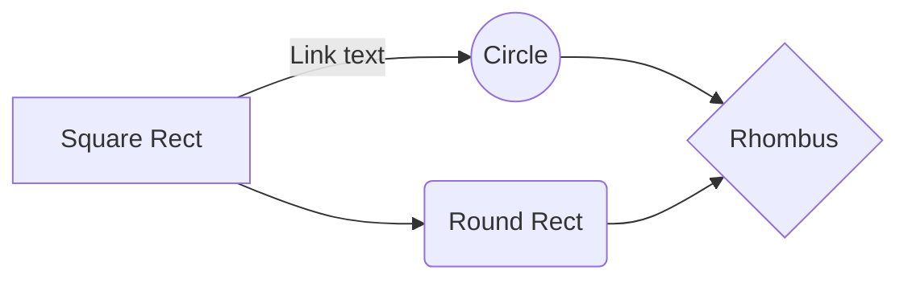

# Rainfall maps in northeastern Mexico a space time interpolation approach through Kriging and Hurst

```mermaid
graph LR
A[Square Rect] -- Link text --> B((Circle))
A --> C(Round Rect)
B --> D{Rhombus}
C --> D
```

