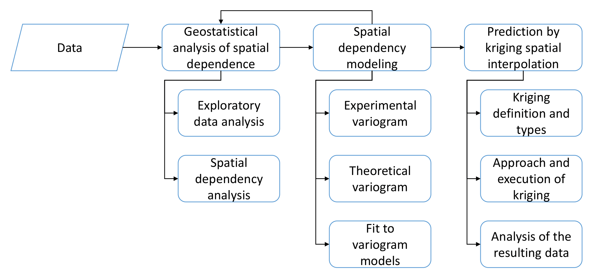
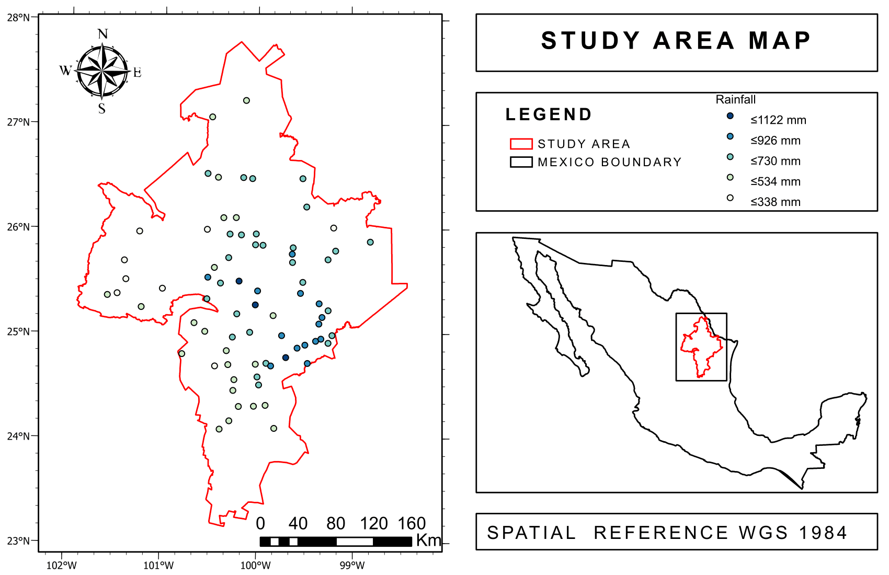
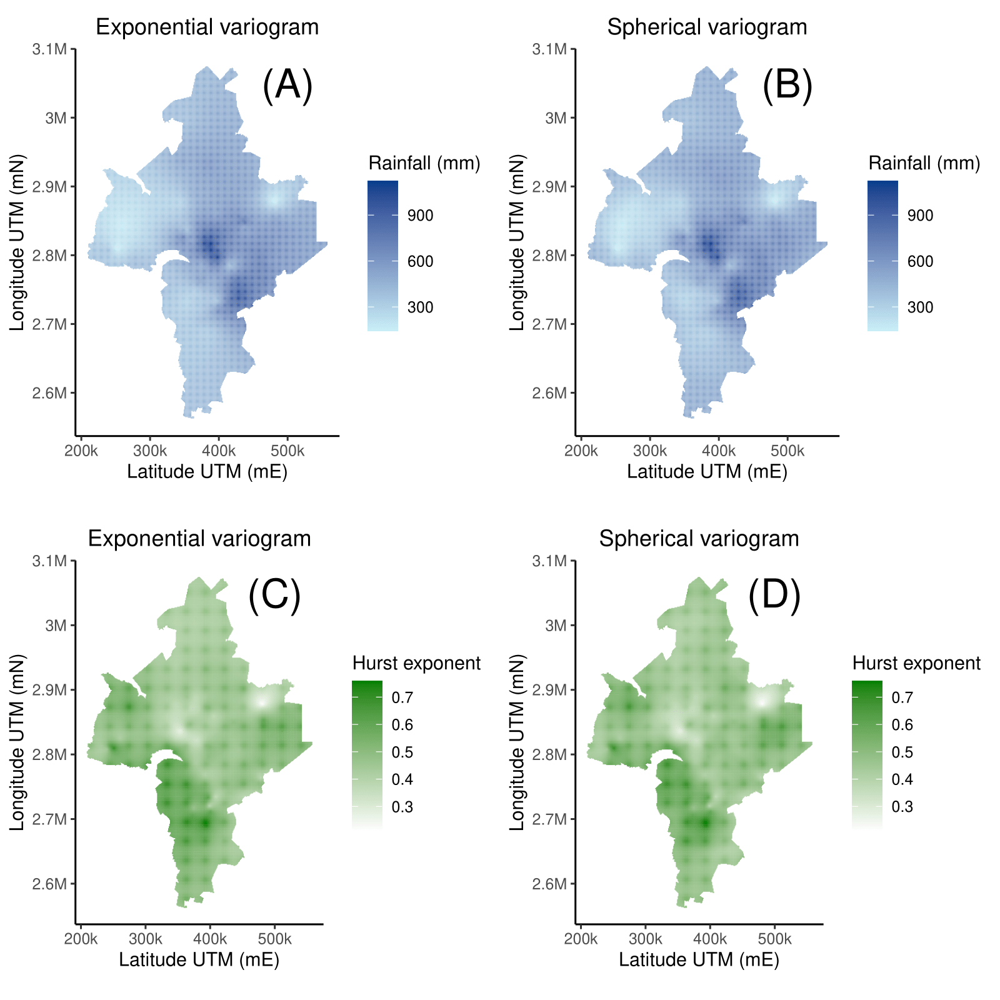

# Rainfall maps in northeastern Mexico a space time interpolation approach through Kriging and Hurst

This repository is made with the purpose of achieving reproducibility of the methodology applied in the article: "Rainfall maps in northeastern México, a space-time interpolation approach through Kriging and Hurst" in Scientific Reports Journal.

## Aim

The study region is the San Juan River basin, located in northeastern México, between the states of Coahuila, Nuevo León and Tamaulipas. Currently, there is a water scarce in this area, so a geospatial analysis is performed with Kriging interpolation, showing the behavior of the area based on the average annual amount of rainfall and its historical behavior of persistence or anti-persistence using the Hurst exponent.

## Introduction

For more detailed information, see Additional File 2 located in the Journal.

Observed data are measurements of the amount of rainfall at different points in a specific region. The spatial correlation of the scalar field _**Z**_ as a function of distance is known as a *variogram* or *semivariogram*. For clarification, although variogram and semivariogram are commonly used interchangeably, they can actually provide certain differences, so using the term variogram urges a complete calculation rather than the partial one that is represented in the semivariogram.

Consider two points with position vectors **_x_** and **_x+h_**, respectively, see Fig. 1.

  

    <em>Fig. 1 - Scalar field Z(x) for this study are the rainfall values or Hurst exponent.</em>

The *variogram* **_γ_** by definition is the variance of the differences of a stationary random field, that is:

    
    

where **_γ_** is independent to the location of **_x_** and dependent only on the vector **_h_**.

**EXPERIMENTAL VARIOGRAM**

The classical estimator or experimental (sample) variogram **_γ_*** is given by the following equation:

   
    

where nc is the number of pairs of points connected by all vectors **_h_** belonging to a class **_H_** of vectors whose magnitude and direction fall within a specific region, see Fig.2.

  

    <em>Fig. 2 - The vector h that goes from the center of the circle to any point in the shaded region is a vector whose magnitude is between |H| and |H +           a|, with direction between θ and θ + b. All the vectors within the shaded region (family H) are the ones that determine the average in the empirical         variogram equation.</em>

**VARIOGRAM PARAMETERS**
The theoretical model associated with the empirical variogram depends in general on three independent parameters known as the *nugget* effect _C0_, the partial *plateau* _C_ and the *range* _R_, see Fig.3.

  

    <em>Fig. 3 - A general theoretical model of the empirical variogram with its principal components: Range, Sill, Partial Sill and Nugget. The origin of           the horizontal scale corresponding to hmin ≡ 0.</em>

- *The nugget effect : According to the definition of the variogram, when _h = 0_ the variogram is also zero, _**γ**(0) = 0_. However, in practice the theoretical value _h = 0_ corresponds to a minimum separation value _hmin_ between rainfall stations. This empirical "residual" value of the variogram is known as the *nugget effect* and is represented by _**γ***(0)= C0_.

- *Partial sill* : Again, according to the definition, in a process without long-range correlations, when _h→∞_ ρ→0 is expected, ρ being the correlation coefficient, therefore, the variogram converges to the constant value _f0_. In practice, however, it is observed that from a certain maximum distance _hmax_ the empirical variogram "stabilizes", that is, the variogram practically does not grow when _h_ increases.This "asymptotic" value, measured from the *nugget*, where the variogram levels with the horizontal is known as the *partial sill* and is symbolized by _C_. The sum _C0 + C_ is conceived as the *sill* or threshold of the variogram.

- *Range* : The value _hmax_ for which the empirical variogram model begins to "flatten" is called *range* and is denoted by the symbol _R ≡ hmax_. Observations of the scalar field at points separated by a distance greater than the range _R_ are considered to be uncorrelated, i.e., if _|xi - xj| > R_ then _Cov[Z(xi), Z(xj)] = 0_, _i ≠ j_. 

**THEORETICAL MODEL**

Four of the most commonly used theoretical models for fitting the experimental or empirical variogram values are as follows, see Fig. 4.

  

    <em>The figure shows 4 of the most commonly used theoretical variogram models, a spherical model (blue curve), a linear model (green curve), a Gaussian           model (purple curve) and an exponential model (orange curve). For comparison purposes, the same parameters have been used in all cases: C0         = 1, C = 3, and a = 1.5. The figure also shows the value of the range for each model: R = a, √3a, 3a for the exponential and linear, Gaussian, and           exponential models, respectively.</em>

**Spherical Variogram**

  

The spherical variogram reaches the threshold value _C0 + C_ exactly when the range is _|h|= R = a_.

**Exponential Variogram**

  

Although theoretically the variogram value for the exponential model reaches the threshold _C0 + C_ when _|h|→∞_, in practice such a threshold is said to have been reached for the value _|h| = a*_ such that _γ(a*) - C0 = 0.95C_, i.e., for an effective range equal to _R ≡ a* ≈ 3a_.

**Gaussian Variogram**

  

Just as in the exponential model, in practice the Gaussian variogram is said to reach the threshold _C0 + C_ when the effective rank _R ≡ a*_ is such that _γ(a*) - C0 = 0.95C_, that is, when _R ≡ a* ≈ √3a_.

**Linear Variogram**

  

**ORDINARY KRIGING INTERPOLATION**

The Ordinary Kriging method assumes that the observed data represent a realization of a second-order stationary spatial stochastic process, i.e., that the mean of the stochastic process is a constant and that its autocovariance function depends only on the separation distance between the observed points. 

In Ordinary Kriging the estimate _Ẑ(x0)_ of the value of the scalar field at the point _x0_ is a linear combination of the observed values _Ẑ(xi)_ of the scalar field at each of the observation points _xi_, that is:

   
   

where _Ẑ(x0)_ is the estimated value of the random field _Z_ at _x0_, _Ẑ(xi)_ is the value of the random field at the point xi, and the λi are the coefficients (weights) to be determined, for _i = 1, 2, .... , n_.

## Methodology

In general, the methodology follows the steps in Fig. 5:

  

**STEP 1 - CLIMATOL DATA PREPARATION**

To begin with, it is recommended to create a folder and set it as the working directory for the project. For this step it is necessary to have downloaded the *Stations* folder in this directory. In this step, the monthly rainfall data information of each station is read and analyzed in which years there is the largest amount of data, with this, the period of _1998-2018_ is chosen. Then, the stations with a quantity greater than or equal to _80%_ of data in that period are filtered. With the values of the stations that pass this filter, files are prepared for use in the *Climatol* library. The program creates the *Climatol* folder inside the working directory with two files, *Rmon_1998-2018.est* with the coordinates and information of each station and *Rmon_1998-2018.dat* with the monthly rainfall values of the stations. These files will be needed for the next step.

**STEP 2 - HOMOGENIZATION BY CLIMATOL**

For this step, it is necessary to set as working directory the *Climatol* folder created previously. This program generates different files, the file *Rmon_1998-2018.txt* is a general diagnosis of the stations, from this file the information of the percentage of original data (POD) is obtained in the file *Stations POD.csv*, and the file *Rmon_1998-2018.pdf* is a report with an exploratory data analysis and the data imputation procedure. The file *Rmon_1998-2018_series.csv* contains the monthly series of stations with data already imputed. To learn more about how the [*Climatol*](https://www.climatol.eu/) library works, visit its official site.
 
**STEP 3 - Hurst exponent and mean rainfall**

It is necessary to have the *Stations POD.csv* and *Stations Info.csv* files downloaded in the working directory, and to generate the *Rmon_1998-2018_series.csv* file from step 2 in the Climatol folder. The stations with a _POD >= 80_ are filtered out with the outliers data removed and homogenized. This program generates the file *Aditional File 1.csv* with the location information of the stations, the annual mean rainfall and Hurst exponent of each one.

**STEP 4 - Exploratory Data Analysis**

It is necessary to have the *Boundary.csv* file and the *Aditional File 1.csv* file generated in the previous step downloaded to the working directory. The *Area.csv* file to be used in the next step is generated. The location maps of the stations within the study area are generated, with a color graph that identifies the intensity of the rainfall and Hurst exponent values. The rainfall and Hurst exponent variables are plotted to see their stationarity according to their longitude, latitude and elevation, and the mean and standard deviation of all stations are measured. Rainfall and Hurst exponent distributions are obtained for the original data, and a log *(Log)* transformation is applied to these data. The asymmetry coefficient was obtained for each of these distributions. It is observed that the original data distributions of both variables are more symmetrical for original data, so it was decided to use the original data for the model, since, to apply the Kriging interpolation it is necessary that the data distribution is symmetrical. In addition, Moran's _I_ and Geary's _c_ autocorrelation coefficients are calculated. For this, the study region was divided into regions according to a Voronoi diagram, taking each station as a node, once this was done, the autocorrelation coefficients were calculated.

**STEP 5 - VARIOGRAM MAP**

It is necessary to have downloaded the file *Aditional File 1.csv* in the working directory. This program makes the variographic map of the study region, this serves to identify anisotropy in the region and the direction of the axes.

**STEP 6 - VARIOGRAM PARAMETERS**

The *Aditional File 1.csv* is needed in the working directory. Here, the parameters of the theoretical models that best fit the experimental variograms of each variable are calculated. The experimental, Gaussian and spherical models are used. The files with the parameters of each model are generated in *Rainfall Parameters.csv* for rainfall data and *Hurst Parameters.csv* for Hurst exponent values.

**STEP 7 - KRIGING MAPS**

The files *Aditional File.csv*, *Area.csv*, *Rainfall Parameters.csv*, *Hurst Parameters.csv* are needed. The interpolation maps are made by means of Ordinary Kriging for both variables. The maps present a color gradient to identify the intensity of each variable. In addition, a cross validation is performed, where metrics such as mean error, Mean Squared Prediction Error (MSPE), Normalized Mean Square Error (NMSE), coefficient of determination between observed and predicted data, and predicted and errors are obtained.

## Results

The location of the study region and each station and the intensity of the variables, mean annual rainfall and Hurst exponent, are shown in Fig. 6. The necessary information can be found in the *Aditional File 1.csv*.

  

    <em>Fig. 6 - The intensity of each variable is identified with a color gradient of blue tones, where lighter tones indicate greater intensity. </em>

The distribution of the original data for each variable is shown in Fig. 7, next to each of them is the distribution of the data transformed by means of Logarithm *Log*. For each distribution, the skewness coefficient was calculated, it is intended to use the data with coefficient closer to 0, that is, more symmetrical. 

  

    <em>Fig. 7 - For the original rainfall data (at the top) a skewness of 0.33 was obtained, and for the transformed data -0.92. For the original Hurst             exponent data (at the bottom) we have a coefficient of -0.07, and -1.03 for transformed data. </em>

Due to the values of the coefficients, it was decided to use the original values of each variable.

The next step is to make use of the variographic map, in Fig. 8, where the angle of the anisotropy axes is established, where for both variables, an angle of 130° is established.

  

    <em>Fig. 8 - Variographic map of both variables, rainfall values on the left and Hurst exponent on the right, showing the anisotropy of the region and           the angle of the axis where the variation is minimal.  </em>

Once the direction is known, the experimental variogram of each variable is made, and it is adjusted to the theoretical exponential, Gaussian and spherical models. The direction parameters of _130°_ with a tolerance of _40°_, a maximum range of _150000 meters_ and a total of _20_ lags are used for rainfall data. For the Hurst exponent, the parameters with a direction of _130°_ with a tolerance of _40°_, a maximum range of _100000 meters_ and a total of _25_ lags were used. The variograms are shown in Fig. 9. 

  

    <em>Fig. 9 - Experimental variograms of rainfall values (left) and Hurst exponent (right) fitted to spherical, Gaussian and spherical models.  </em>

With these variograms, it was decided to apply Ordinary Kriging for theoretical exponential and Gaussian model variograms. Fig.10 shows the interpolated maps for each variable.

  

    <em>Fig. 10 - The rainfall maps for exponential and spherical models are shown at the top, and for the Hurst exponent at the bottom.  </em>

## Discussion and conclusion

The findings show that the zones that register anti-persistence and high rainfall, according to the orography, are located mainly at the foot of the Eastern Sierra Madre (SMO) mountains. Another characteristic of this zone is the anisotropy of the antipersistence (spatial directionality at _130°_), indicated as a yellow strip in the central part of the region and coinciding with the abundant vegetation of the SMO. This implies that in this strip it rains a few days a year but abundantly, making these areas ideal for water collection, which justifies the location of the La Boca and Cerro Prieto dams. In contrast, there are areas with a predominantly arid climate, located in the southwestern direction of the region at an altitude of _1600 masl_. Another contribution of this methodology is the geographical identification of humid zones, with excellent conditions for agriculture and cattle raising.

  

    <em>Fig. 11 - INEGI. </em>

Otherwise, areas with lower historical rainfall tend to have a persistent Hurst exponent, making the rainy seasons long, but with little rainfall. These results can prevent the construction of cities without proper flood control in these areas, the creation of artificial lakes rising from areas with anti-persistent rainfall to the other parts of the area, or the construction of dams to collect and exploit more efficiently the rainfall conditions of these places.
