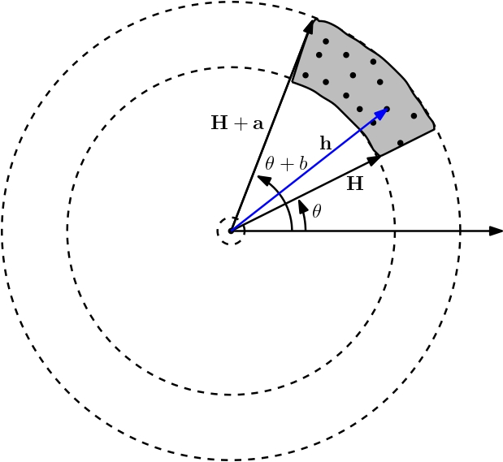

# Rainfall maps in northeastern Mexico a space time interpolation approach through Kriging and Hurst

Este repositorio está hecho con el propósito lograr la reproducibilidad de la metodología aplicada en el artículo : "Rainfall maps in northeastern Mexico a space time interpolation approach through Kriging and Hurst" (hipervínculo al artículo).

## Objetivo 

La región de estudio es la cuenca del Rio San Juan ubicada en el noreste de México, entre los estados de Coahuila, Nuevo León y Tamaulipas. Actualmente, existe una escazes de agua en esta zona, por lo que se realiza un análisis geoespacial con interpolación de Kriging, mostrando el comportamiento de la zona en base a la cantidad promedio anual de lluvia y su comportamiento histórico de  persistencia o anti-persistencia utilizando el exponente de Hurst.

## Marco teórico

Para información más detallada, revisar el Archivo Aditional 2 (hipervínculo al archivo adicional 2).

Los datos observados son mediciones de la cantidad de lluvia en distintos puntos de una región específica. La correlación espacial del campo escalar _**Z**_ como función de la distancia se conoce como *variograma* o *semivariograma*. En aclaración, aunque variograma y semivariograma son comúnmente utilizaos indistintamente, realmente pueden aportar ciertas diferencias, por ello usar el término variograma insta a realizar un cálculo completo en vez de uno parcial que es representado en el semivariograma.

Considere dos puntos con vectores de posición **_x_** y **_x+h_**, respectivamente, ver la Fig. 1.

  

    <em>Fig. 1 - Campo escalar Z(x) para este estudio son los valores de lluvia o exponente de Hurst. </em>

El *variograma* **_γ_** por definición es la varianza de las diferencias de un campo aleatorio estacionario, esto es: 

    
    

 donde **_γ_** es independiente a la localización de **_x_** y dependiente solamente del vector **_h_**.

**VARIOGRAMA EXPERIMENTAL**

El estimador clásico o variograma experimental (muestral) **_γ_*** es dado por la siguiente ecuacuión:

   
    

donde nc es el número de parejas de puntos conectados por todos los vectores **_h_** que pertenecen a una clase **_H_** de vectores cuya magnitud y dirección caen dentro de una región específica, ver la Fig.2.

  

    <em>Fig. 2 - El vector h que va del centro del círculo a cualquier punto de la región sombreada es un vector cuya magnitud está comprendida entre                 |H| y |H + a|,  con dirección comprendia entre θ y θ + b. Todos los vectores dentro de la región sombreada (famila H) son los que determinan el               promedio en la ecuación del variograma empírico.</em>

**PARÁMETROS DEL VARIOGRAMA**

El modelo teórico asociado al variograma empírico depende en general de tres parámetros independientes conocidos como el efecto *nugget* _C0_, la *meseta* parcial _C_ y el *rango* _R_, ver la Fig.3.

  

    <em>Fig. 3 - A general theoretical model of the empirical variogram with its principal components: Range, Sill, Partial Sill and Nugget. The origin of           the horizontal scale corresponding to hmin ≡ 0.</em>

 - *El efecto nugget* : De acuerdo con la definición del variograma, cuando _h = 0_ el variograma también vale cero, _**γ**(0) = 0_. Sin embargo, en la práctica el valor teórico _h = 0_ corresponde a un valor de separación mínimo _hmin_ entre las estaciones pluviométricas. A este valor "residual" empírico del variograma se le conoce como *efecto nugget* y se representa por _**γ***(0)= C0_.

- *Meseta parcial* : Nuevamente, de acuerdo con la definición, en un proceso sin correlaciones de largo alcance, cuando _h→∞_  se espera que ρ→0, siendo ρ el coeficiente de correlación, por lo tanto, el variograma converge al valor constante _f0_. En la práctica, sin embargo, se observa que a partir de cierta distancia máxima _hmax_ el variograma empírico se "estabiliza", esto es, el variograma prácticamente ya no crece cuando _h_ aumenta. Este valor "asintótico", medido desde el *nugget*, donde el variograma se nivela con la horizontal se conoce como la *meseta parcial* y se simboliza por _C_. La suma _C0 + C_ se conce como la *meseta* o umbral del variograma.

- *Rango* : El valor  _hmax_ para el cual el modelo del variograma empírico comienza a "aplanarse" se denomina *rango* y se denota por el símbolo _R ≡ hmax_. Observaciones del campo escalar en puntos separados una distancia mayor al rango _R_ se consideran no correlacionadas, esto es, si _|xi - xj| > R_ entonces _Cov[Z(xi), Z(xj)] = 0_, _i ≠ j_.

**MODELO TEÓRICO**

Cuatro de los modelos teóricos más utilizados para ajustar los valores del variograma experimental o empírico son los siguientes \cite{mert4,montero5}, ver la Fig. 4.

  

    <em>Fig. 4 - La figura muestra 4 de los modelos teóricos de variogramas más utilizados, un modelo esférico (curva azul), un modelo lineal (curva verde),         un modelo Gaussiano (curva morada) y un modelo exponencial (curva naranja). Para fines de comparación en todos los casos se han utilizado los mismos         parámetros: C0 = 1, C = 3, y a = 1.5. La figura muestra también el valor del rango para cada modelo: R = a, √3a, 3a para los modelos               exponencial y lineal, Gaussiano, y exponencial, respectivamente.</em>

**Variograma esférico**

  

El variograma esférico alcanza el valor umbral _C0 + C_ exactamente cuando el rango es _|h|= R = a_.

**Variograma exponencial**

  

Aunque teóricamente el valor del variograma para el modelo exponencial alcanza el umbral _C0 + C_ cuando _|h|→∞_, en la práctica se dice que se ha alcanzado dicho umbral para el valor  _|h| = a*_ tal que _γ(a*) - C0 = 0.95C_, esto es, para un rango efectivo igual a _R ≡ a* ≈ 3a_.

**Variograma Gaussiano**

  

Justo como en el modelo exponencial, en la práctica se dice que el variograma Gaussiano alcanza el umbral _C0 + C_ cuando el rango efectivo _R ≡ a*_ es tal que _γ(a*) - C0 = 0.95C_, esto es, cuando _R ≡ a* ≈ √3a_.

**Variograma lineal**

  

**INTERPOLACIÓN DE KRIGING ORDINARIO**

El método de Kriging Ordinario supone que los datos observados representan una realización de un proceso estocástico espacial estacionario de segundo orden, esto es, que la media del proceso estocástico es una constante y que su función de autocovarianza depende únicamente de la distancia de separación entre los puntos observados. 

En el Kriging Ordinario la estimación _Ẑ(x0)_ del valor del campo escalar en el punto _x0_ es una combinación lineal de los valores observados _Ẑ(xi)_ del campo escalar en cada uno de los puntos de observación _xi_, es decir:

   
   

donde _Ẑ(x0)_ es el valor estimado del campo aleatorio _Z_ en  _x0_, _Ẑ(xi)_ es el valor del campo aleatorio en el punto xi, y los λi son los coeficientes (pesos) a ser determinados, para _i = 1, 2, ... , n_.

## Metodología

**STEP 1 - CLIMATOL DATA PREPARATION**

Para empezar, se recomienda crear una carpeta y establecerla como directorio de trabajo para realizar el proyecto. Para este paso es necesario tener descargada la carpeta *Stations* en este directorio. En este paso, se lee la información de datos mensuales de lluvia de cada estación y se analizan en que años existe la mayor cantidad de datos, con esto, se elige el periodo de _1998-2018_. Después, se filtran las estaciones con una cantidad mayor o igual a _80%_ de datos en ese periodo. Con los valores de las estaciones que pasan este filtro, se preparan los archivos para utilizarlos en la libreria *Climatol*. El programa crea la carpeta *Climatol* dentro del directorio de trabajo con dos archivos, *Rmon_1998-2018.est* con las coordenadas e información de cada estación y *Rmon_1998-2018.dat* con los valores mensuales de lluvia de las estaciones. Estos  archivos serán necesarios para el siguiente paso.

**STEP 2 - HOMOGENIZATION BY CLIMATOL**

Para este paso, es necesario establecer como directorio de trabajo la carpeta *Climatol* creada anteriormente. Este programa genera distintos archivos, el archivo *Rmon_1998-2018.txt* es un diagnóstico general de las estaciones, y el archivo *Rmon_1998-2018.pdf* es un informe con un análisis exploratorio de datos y el procedimiento de imputación de los datos. El archivo *Rmon_1998-2018_series.csv* contiene las series mensuales de las estaciones con datos ya imputados. Para conocer más de cómo funciona la librería [*Climatol*](https://www.climatol.eu/) visitar su sitio oficial.
 

